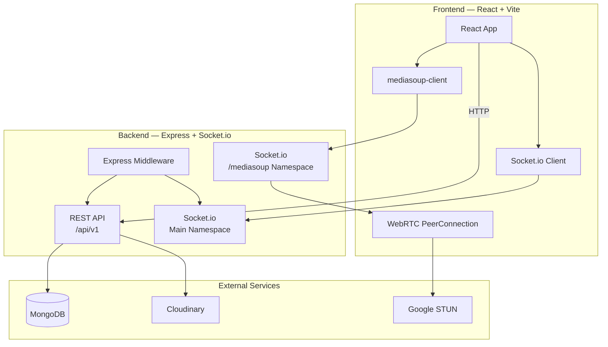
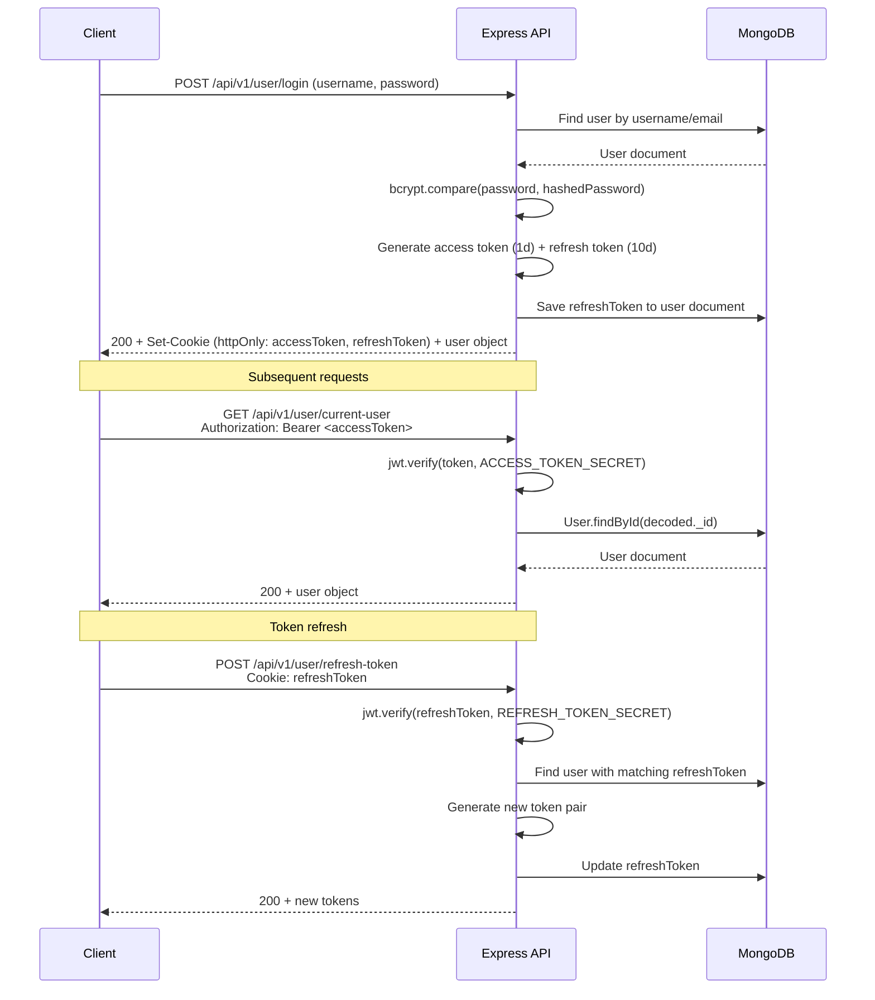
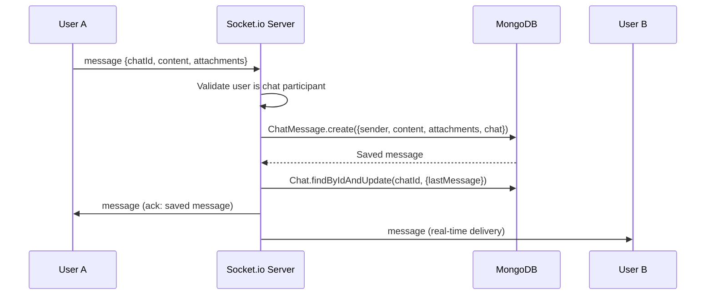
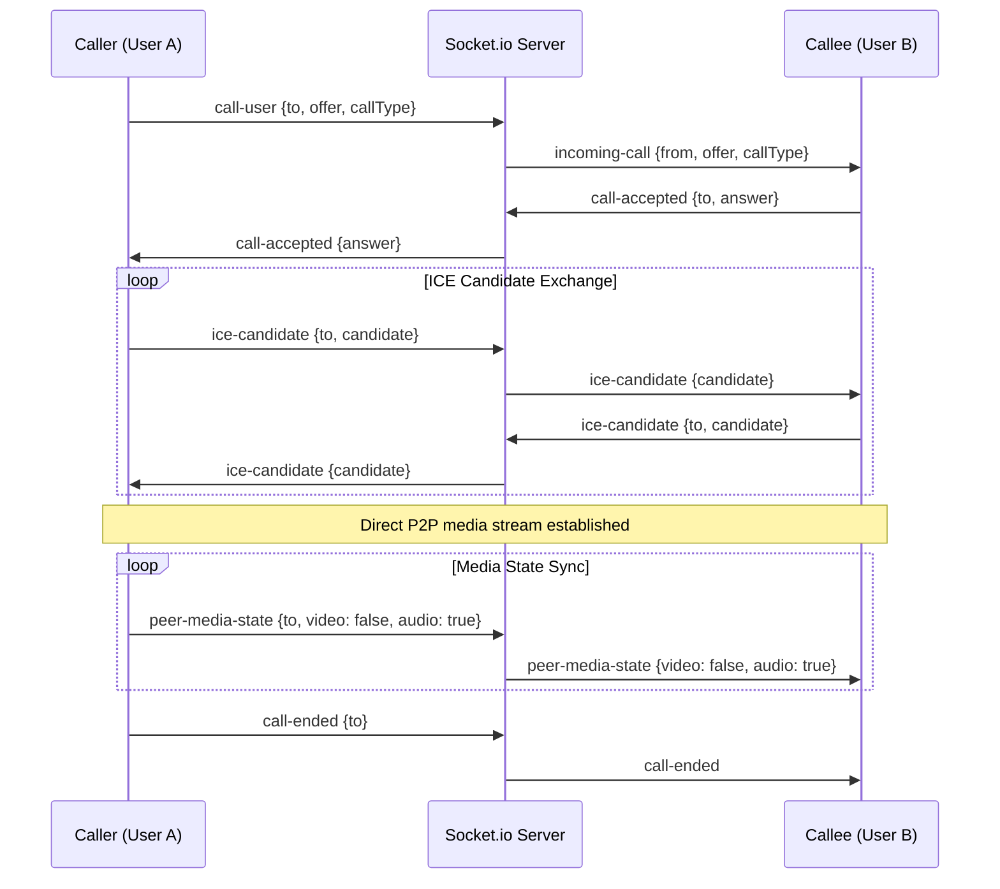
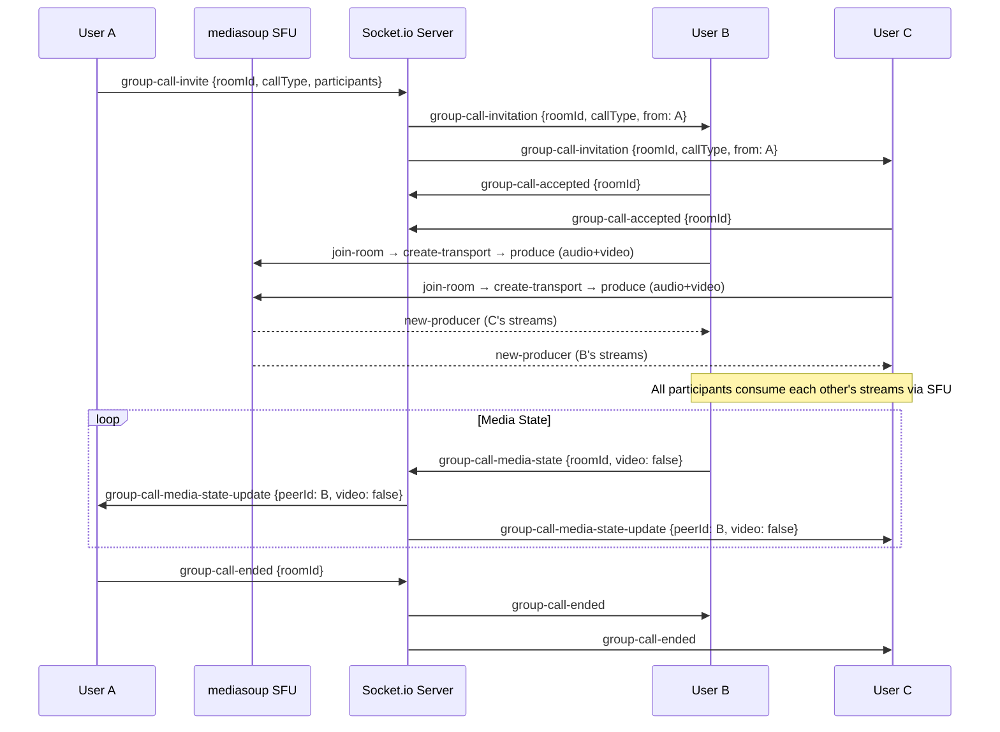
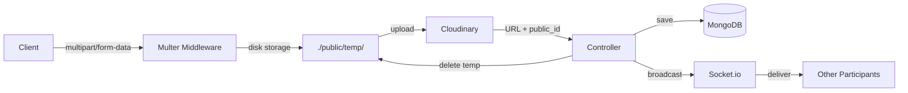
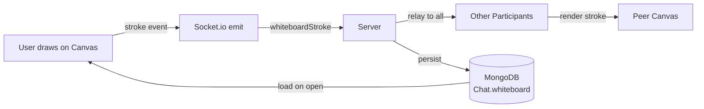

# Threadly

A retro-themed real-time chat application with built-in 1:1 & group video/audio calls, collaborative whiteboard, and file sharing — solving the limitations of WhatsApp Web.

> **Live Demo:** *(Soon)*

---

## Table of Contents

- [Overview](#overview)
- [Features](#features)
- [Tech Stack](#tech-stack)
- [Architecture](#architecture)
- [Monorepo Structure](#monorepo-structure)
- [Getting Started](#getting-started)
- [Running the App](#running-the-app)
- [Project Structure](#project-structure)
- [API Endpoints](#api-endpoints)
- [Socket Events](#socket-events)
- [Deployment](#deployment)

---

## Overview

Threadly is a full-stack monorepo built with Turborepo. It provides real-time messaging, peer-to-peer video/audio calls, SFU-based group calls via mediasoup, a collaborative canvas whiteboard, and file sharing through Cloudinary — all wrapped in a retro neobrutalist UI.

**Problem it solves:** WhatsApp Web lacks built-in calling(They did lack it before I started the app), and collaborative whiteboard features. Threadly brings all of these into a single unified interface.

---

## Features

| Category | Details |
|---|---|
| **Auth** | Registration, login, JWT access/refresh token rotation, avatar upload |
| **Messaging** | Real-time 1:1 & group chat, typing indicators, file/image/video/PDF attachments |
| **1:1 Calls** | WebRTC peer-to-peer audio & video calls with mute/camera toggle |
| **Group Calls** | mediasoup SFU-based group audio & video for 3+ participants |
| **Whiteboard** | Canvas-based collaborative whiteboard with pen, eraser, shapes, real-time sync & persistence |
| **File Sharing** | Upload via Multer → Cloudinary, with backend-proxied downloads (SSRF protection) |
| **Notifications** | Incoming call alerts with ring sounds, new message sounds |
| **Groups** | Create/rename/delete groups, add/remove participants, admin controls |
| **Call Logs** | Track audio/video call history (missed, answered) |
| **API Docs** | Swagger UI auto-generated from route definitions |

---

## Tech Stack

| Layer | Technology |
|---|---|
| **Monorepo** | Turborepo + pnpm |
| **Frontend** | React 19, TypeScript, Vite, Tailwind CSS 4, shadcn/ui |
| **Backend** | Express 5, TypeScript, Socket.io 4 |
| **Database** | MongoDB + Mongoose 8 |
| **Auth** | JWT (access + refresh tokens), bcryptjs |
| **1:1 Calls** | Native WebRTC (STUN via Google) |
| **Group Calls** | mediasoup 3 SFU (server) + mediasoup-client (browser) |
| **File Upload** | Multer (temp) → Cloudinary (cloud) |
| **Validation** | express-validator |
| **Rate Limiting** | express-rate-limit |
| **Logging** | Winston + Morgan |
| **HTTP Client** | Axios |

---

## Architecture

### System Overview



### Authentication Flow



### Real-time Messaging Flow



### 1:1 Call Flow (WebRTC)



### Group Call Flow (mediasoup SFU)



### File Upload Flow



### Whiteboard Sync Flow



---

## Monorepo Structure

```
chatApp_monorepo/
├── apps/
│   ├── http-server-Be/        # Express + Socket.io backend
│   └── react-Fe/              # React + Vite frontend
├── packages/
│   ├── ui/                    # Shared React component library
│   ├── eslint-config/         # Shared ESLint configs
│   └── typescript-config/     # Shared tsconfig.json files
├── turbo.json                 # Turborepo pipeline config
├── pnpm-workspace.yaml        # pnpm workspace definition
└── package.json               # Root scripts (dev, build, lint)
```

| Package | Description |
|---|---|
| `http-server-Be` | REST API, Socket.io, mediasoup SFU, MongoDB models, auth middleware |
| `react-Fe` | React SPA with context providers, call modals, whiteboard, retro UI |
| `@repo/ui` | Shared component library (currently a stub) |
| `@repo/eslint-config` | ESLint presets for React and Node |
| `@repo/typescript-config` | Base, React, and Next.js TypeScript configs |

---

## Getting Started

### Prerequisites

| Tool | Version | Purpose |
|---|---|---|
| **Node.js** | ≥ 18 | Runtime |
| **pnpm** | ≥ 12 | Package manager |
| **MongoDB** | ≥ 6 | Database (local or Atlas) |
| **Cloudinary** | — | File/image upload storage (free tier works) |

### 1. Clone & Install

```bash
git clone https://github.com/Barmanji/Threadly.git
cd Threadly
pnpm install
```

### 2. Environment Variables

Copy the example env files and fill in your values:

```bash
cp apps/http-server-Be/.env.example apps/http-server-Be/.env
cp apps/react-Fe/.env.example apps/react-Fe/.env
```

See the `.env.example` files in each app for the full list of variables:

- [`apps/http-server-Be/.env.example`](apps/http-server-Be/.env.example) — Backend (MongoDB, JWT secrets, Cloudinary, mediasoup)
- [`apps/react-Fe/.env.example`](apps/react-Fe/.env.example) — Frontend (API URL, Socket.io URL, mediasoup URL)

### 3. Start MongoDB

If running locally:

```bash
mongod --dbpath /path/to/data/dir
```

Or use MongoDB Atlas — just update `MONGODB_LOCAL_URI` in the backend `.env` to your Atlas connection string.

### 4. Run the App

From the project root:

```bash
pnpm run dev
```

This starts both the backend and frontend concurrently via Turborepo:

| Service | URL |
|---|---|
| Frontend | `http://localhost:5173` |
| Backend API | `http://localhost:3004/api/v1` |
| Swagger Docs | `http://localhost:3004/` (root) |

---

## Project Structure

### Backend (`apps/http-server-Be/src/`)

```
src/
├── index.ts                          # Entry point — starts server
├── app.ts                            # Express + Socket.io setup
├── constants.ts                      # DB_NAME, ChatEventEnum
├── config/
│   └── db.ts                         # MongoDB connection
├── controllers/
│   ├── user.controller.ts            # Auth, profile, friends
│   ├── chat.controller.ts            # Chat CRUD, group management
│   ├── message.controller.ts         # Messages, attachments, downloads
│   ├── callLog.controller.ts         # Call history
│   └── healthcheck.controller.ts     # Health endpoint
├── models/
│   ├── user/user.model.ts            # User schema (JWT generation, bcrypt)
│   ├── chat/chat.model.ts            # Chat schema (1:1 + group)
│   ├── chat/message.model.ts         # Message schema (text + attachments)
│   └── calls/callLogs.model.ts       # Call log schema
├── routes/                           # Express route definitions
├── middlewares/
│   ├── auth.middleware.ts            # JWT verification
│   ├── error.middleware.ts           # Global error handler
│   └── multer.middleware.ts          # File upload (disk storage)
├── socket/
│   ├── socket.ts                     # Main namespace — messaging, typing, calls
│   └── mediasoup.ts                  # /mediasoup namespace — SFU rooms
├── utils/
│   ├── ApiError.ts                   # Custom error class
│   ├── ApiResponse.ts                # Standardized responses
│   ├── asyncHandler.ts              # Async error wrapper
│   └── fileUploaderCloudinary.ts     # Cloudinary upload/delete
├── validators/                       # express-validator schemas
└── logger/
    ├── winston.logger.ts             # File + console logging
    └── morgor.logger.ts              # HTTP request logging
```

### Frontend (`apps/react-Fe/src/`)

```
src/
├── main.tsx                          # Entry point — provider tree
├── App.tsx                           # Route definitions
├── index.css                         # Tailwind v4 theme, neo utilities, bg-doodle
├── api/index.ts                      # Axios client + all API functions
├── context/
│   ├── AuthContext.tsx                # Auth state, login/logout
│   ├── SocketContext.tsx              # Socket.io connection
│   ├── WebRTCContext.tsx              # 1:1 P2P calls, remote media state
│   └── GroupCallContext.tsx           # mediasoup SFU group calls
├── config/webrtc.ts                  # STUN server config
├── interfaces/                       # TypeScript interfaces
├── components/
│   ├── WhiteBoard.tsx                # Canvas whiteboard with tools + sync
│   ├── PrivateRoute.tsx              # Auth guard
│   ├── PublicRoute.tsx               # Redirect if authenticated
│   ├── RetroConfirm.tsx              # Confirmation dialog
│   ├── landing/
│   │   ├── HeroSection.tsx           # Hero with floating shapes
│   │   └── StackingCards.tsx         # Scroll-stacking feature cards
│   ├── call/
│   │   ├── CallModal.tsx             # 1:1 video/audio call UI
│   │   ├── IncomingCallModal.tsx     # Incoming call alert
│   │   ├── GroupCallModal.tsx        # Group call grid UI
│   │   └── GroupCallNotification.tsx # Group call ring notification
│   └── chat/
│       ├── AddChatModal.tsx          # Create 1:1 or group chat
│       ├── ChatItem.tsx              # Chat list item
│       ├── MessageItem.tsx           # Message bubble
│       └── GroupChatDetailsModal.tsx # Group settings
├── pages/
│   ├── landing.tsx                   # Landing page
│   ├── chat.tsx                      # Main chat page (sidebar + messages)
│   ├── login.tsx                     # Login form
│   └── register.tsx                  # Register form
└── utils/
    ├── index.ts                      # requestHandler, LocalStorage, downloadFile
    └── useVoiceActivity.ts           # Voice activity detection hook
```

---

## API Endpoints

All routes are prefixed with `/api/v1`.

### User

| Method | Endpoint | Description | Auth |
|---|---|---|---|
| POST | `/user/register` | Register new user | No |
| POST | `/user/login` | Login | No |
| POST | `/user/refresh-token` | Refresh JWT | No |
| POST | `/user/logout` | Logout | Yes |
| GET | `/user/current-user` | Get current user | Yes |
| PUT | `/user/change-password` | Change password | Yes |
| PUT | `/user/update-account` | Update username/email | Yes |
| PUT | `/user/update-profile-picture` | Update avatar | Yes |
| PUT | `/user/update-bio` | Update bio | Yes |
| GET | `/user/get-all-users` | List all users | Yes |
| GET | `/user/get-my-friend-list` | My friends | Yes |
| GET | `/user/c/:username` | Get user profile | No |
| GET | `/user/get-any-user-friend-list/c/:username` | Get user's friends | No |

### Chat

| Method | Endpoint | Description | Auth |
|---|---|---|---|
| GET | `/chats` | Get all my chats | Yes |
| GET | `/chats/users` | Search users | Yes |
| POST | `/chats/c/:receiverId` | Create/get 1:1 chat | Yes |
| POST | `/chats/group` | Create group chat | Yes |
| GET | `/chats/group/:chatId` | Get group details | Yes |
| PATCH | `/chats/group/:chatId` | Rename group | Yes |
| DELETE | `/chats/group/:chatId` | Delete group | Yes |
| POST | `/chats/group/:chatId/:participantId` | Add participant | Yes |
| DELETE | `/chats/group/:chatId/:participantId` | Remove participant | Yes |
| PATCH | `/chats/remove/:chatId` | Delete 1:1 chat | Yes |

### Message

| Method | Endpoint | Description | Auth |
|---|---|---|---|
| GET | `/messages/:chatId` | Get all messages | Yes |
| POST | `/messages/:chatId` | Send message | Yes |
| DELETE | `/messages/:chatId/:messageId` | Delete message | Yes |

### Other

| Method | Endpoint | Description | Auth |
|---|---|---|---|
| GET | `/healthcheck` | Health status | No |

---

## Socket Events

### Main Namespace (`/`)

#### Messaging

| Event | Direction | Payload | Description |
|---|---|---|---|
| `message` | C↔S | `{chatId, content, attachments}` | Send/receive messages |
| `chatCreated` | S→C | `{chat}` | New chat notification |
| `chatUpdated` | S→C | `{chat}` | Chat renamed/participants changed |
| `typing` | C↔S | `{chatId, userId}` | User is typing |
| `stopTyping` | C↔S | `{chatId, userId}` | User stopped typing |

#### 1:1 Calls

| Event | Direction | Payload | Description |
|---|---|---|---|
| `call-user` | C→S | `{to, offer, callType}` | Initiate call |
| `incoming-call` | S→C | `{from, offer, callType}` | Incoming call alert |
| `call-accepted` | C↔S | `{to, answer}` | Call accepted |
| `call-rejected` | C↔S | `{to}` | Call rejected |
| `call-ended` | C↔S | `{to}` | Call ended |
| `ice-candidate` | C↔S | `{to, candidate}` | ICE candidate relay |
| `peer-media-state` | C↔S | `{to, audio?, video?}` | Mute/camera state relay |

#### Group Calls

| Event | Direction | Payload | Description |
|---|---|---|---|
| `group-call-invite` | C→S | `{roomId, callType, participants}` | Start group call |
| `group-call-invitation` | S→C | `{roomId, callType, from}` | Incoming group call |
| `group-call-accepted` | C→S | `{roomId}` | Accept group call |
| `group-call-cancelled` | C→S | `{roomId, participants}` | Cancel group call |
| `group-call-ended` | C→S | `{roomId}` | End group call |
| `group-call-media-state` | C→S | `{roomId, video, audio}` | Toggle media |
| `group-call-media-state-update` | S→C | `{peerId, video, audio}` | Remote state change |

#### Whiteboard

| Event | Direction | Payload | Description |
|---|---|---|---|
| `whiteboardStroke` | C↔S | `{chatId, stroke}` | Canvas stroke sync |
| `whiteboardClear` | C↔S | `{chatId}` | Clear whiteboard |
| `whiteboardOpen` | C→S | `{chatId}` | Whiteboard opened |
| `whiteboardOpenCancel` | C→S | `{chatId}` | Whiteboard dismissed |

### mediasoup Namespace (`/mediasoup`)

| Event | Direction | Payload | Description |
|---|---|---|---|
| `join-room` | C→S | `{roomId}` | Join SFU room |
| `leave-room` | C→S | `{roomId}` | Leave SFU room |
| `get-participants` | C→S | `{roomId}` | List room participants |
| `participants` | S→C | `[{socketId, user}]` | Participant list |
| `create-transport` | C→S | `{sender}` | Create WebRTC transport |
| `transport-created` | S→C | `{id, iceParameters, iceCandidates, dtlsParameters}` | Transport params |
| `connect-transport` | C→S | `{transportId, dtlsParameters}` | Connect transport |
| `produce` | C→S | `{transportId, kind, rtpParameters}` | Start producing |
| `produced` | S→C | `{id}` | Producer ID assigned |
| `new-producer` | S→C | `{producerId, kind, user}` | New producer available |
| `consume` | C→S | `{producerId, rtpCapabilities}` | Consume producer |
| `consumed` | S→C | `{id, producerId, kind, rtpParameters}` | Consumer params |
| `producer-closed` | S→C | `{producerId}` | Producer closed |

---

## Deployment

### Production Considerations

| Concern | Solution |
|---|---|
| **MEDIASOUP_ANNOUNCED_IP** | Set to your server's public IP for real network calls |
| **CORS_ORIGIN** | Set to your frontend's production domain |
| **MongoDB** | Use MongoDB Atlas or a managed instance |
| **Cloudinary** | Free tier handles moderate usage |
| **HTTPS** | Required for WebRTC in production (use nginx/reverse proxy) |
| **Rate Limiting** | Default: 5000 req/15min per IP — adjust as needed |
| **Socket.io Buffer** | Set to 5MB (`maxHttpBufferSize`) for whiteboard scene data |

### Nginx Reverse Proxy

An example nginx config is provided in `ngnix-conf/ngnix-prof.conf` (commented out). Key points:

- Proxy `/api` and `/socket.io` to the backend
- Enable WebSocket upgrade headers for Socket.io
- SSL termination for HTTPS (required for WebRTC)

---

## Future Improvements

- [ ] Socket and WebRTC Scale
- [ ] Message read receipts and delivery status
- [ ] Screen sharing in group calls
- [ ] Message search
- [ ] Push notifications (Firebase / OneSignal)
- [ ] Docker Compose setup for one-command deployment
- [ ] Redis for session store and Socket.io adapter (horizontal scaling)
- [ ] Message reactions and replies
- [ ] Voice messages

---

## License

This project is open source. See the repository for license details.
